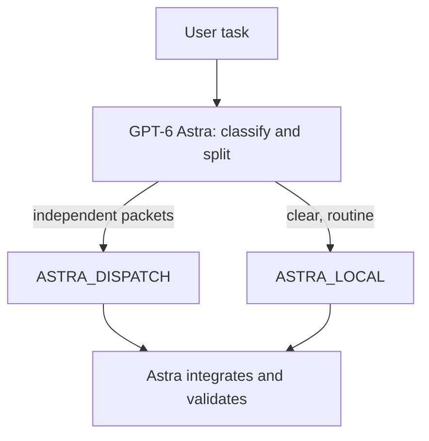

# Astra-dispatch Codex workflow

[中文说明](README.md)

This repository is a **Codex configuration pack**, not an application.

GPT-6 Astra is the advisor and orchestrator. It splits work into disjoint packets and dispatches specialist workers in parallel.

Model-calling examples in this repo use the GPT-稳定 group on [xclis.ai](https://xclis.ai). Swap `base_url` and `env_key` for whatever provider you prefer.

## What this project does

1. **Astra advises and accepts.** High-impact decisions stay in the primary thread. Workers execute bounded packets and never claim final acceptance.
2. **Dispatch by published strengths.** Coding, long-horizon refactors, live search, Chinese office work, and reduced-refusal packets go to different workers.
3. **Parallelism requires disjoint writable files.** One owner per file.
4. **Files on disk do not prove a model ran.** Report a model only when agent activity or a tool result identifies it.

Subagents still consume tokens and remain subject to account, model access, and concurrency limits.

## Architecture



- `ASTRA_LOCAL`: one Astra thread is cheaper than delegation.
- `ASTRA_DISPATCH`: at least two independent, disjoint, separately verifiable packets.

High-impact decisions stay in the Astra primary thread. Send high-stakes implementation to `sol_worker`.

## Roster

All of these model IDs use the same provider in the examples.

| Role | Agent | Model ID |
| --- | --- | --- |
| Advisor / orchestrator | primary | `gpt-6-astra` |
| High-stakes professional work | `sol_worker` | `gpt-5.6-sol` |
| Cheap fallback | `luna_worker` | `gpt-5.6-luna` |
| Fast coding | `deepseek_flash_worker` | `deepseek-v4-flash` |
| Long-horizon / multimodal | `gemini_flash_worker` | `gemini-3.8-flash` |
| Live web / X search | `grok_worker` | `grok-4.6` |
| Chinese / office | `qwen_flash_worker` | `Qwen3.8-Flash-Next` |
| Reduced-refusal | `qwen_uncensored_worker` | `qwen3.8-27b` |

See [docs/models.md](docs/models.md) for vendor capabilities.

## Provider example

User-level `~/.codex/config.toml` only. Project config cannot set `model_providers`. Codex requires `wire_api = "responses"`.

```toml
model = "gpt-6-astra"
model_reasoning_effort = "high"
model_provider = "example"

[model_providers.example]
name = "example"
base_url = "https://jp.xclis.ai/v1"
env_key = "API_KEY"
wire_api = "responses"
requires_openai_auth = false
supports_websockets = false
```

```bash
export API_KEY="sk-..."
API_KEY="$API_KEY" codex
```

Change only the `model` field to any ID in the roster. More replacement notes: [docs/providers.md](docs/providers.md).

## Install

Merge `.codex/config.toml`, `.codex/agents/*.toml`, and `AGENTS.md` into a project, then start a **new** Codex task.

A custom agent needs `name`, `description`, and `developer_instructions`. Copy agent files to `~/.codex/agents/` for personal use.

## License

[MIT](LICENSE)
