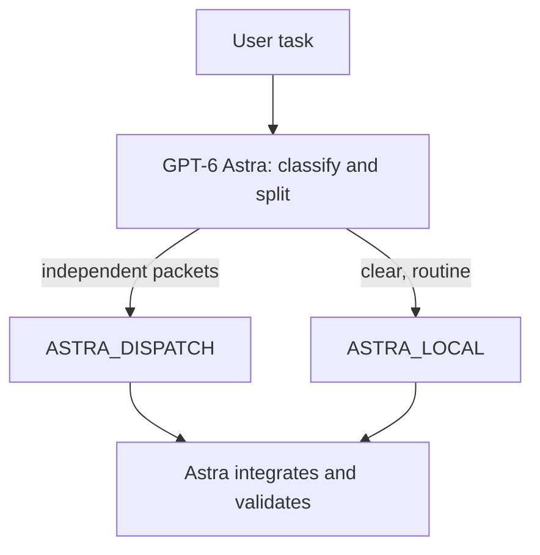

# Astra-dispatch Codex workflow

[中文说明](README.md)

This repository is a **Codex configuration pack**, not an application.

GPT-6 Astra is the advisor and orchestrator. It splits work into disjoint packets and dispatches specialist workers in parallel. All GPT calling examples in this repo use the official **[Xclis.ai](https://xclis.ai) GPT-稳定 (Stable)** group.

## What this project does

1. **Astra advises and accepts.** High-impact decisions stay in the primary thread. Workers execute bounded packets and never claim final acceptance.
2. **Dispatch by published strengths.** Coding, long-horizon refactors, live search, Chinese office work, and reduced-refusal packets go to different workers.
3. **GPT traffic uses Xclis GPT-稳定.** That is Xclis’s PRO channel for Codex / Codex App. The group is bound to the API key; requests still use official model IDs.
4. **Parallelism requires disjoint writable files.** One owner per file.
5. **Files on disk do not prove a model ran.** Report a model only when agent activity or a tool result identifies it.

Subagents still consume tokens and remain subject to account, group, and concurrency limits.

## Architecture



- `ASTRA_LOCAL`: one Astra thread is cheaper than delegation.
- `ASTRA_DISPATCH`: at least two independent, disjoint, separately verifiable packets.

High-impact decisions stay in the Astra primary thread. Send high-stakes implementation to `sol_worker`.

## Roster

| Role | Agent | Model ID | How this repo calls it |
| --- | --- | --- | --- |
| Advisor / orchestrator | primary | `gpt-6-astra` | Xclis **GPT-稳定** |
| High-stakes professional work | `sol_worker` | `gpt-5.6-sol` | Xclis **GPT-稳定** |
| Cheap OpenAI fallback | `luna_worker` | `gpt-5.6-luna` | Xclis **GPT-稳定** |
| Fast cheap coding | `deepseek_flash_worker` | `deepseek-v4-flash` | [providers](docs/providers.md) |
| Long-horizon / multimodal | `gemini_flash_worker` | `gemini-3.8-flash` | [providers](docs/providers.md) |
| Live web / X search | `grok_worker` | `grok-4.6` | [providers](docs/providers.md) |
| Chinese / office | `qwen_flash_worker` | `qwen3.8-flash` | [providers](docs/providers.md) |
| Reduced-refusal | `qwen_uncensored_worker` | `qwen3.8-27b` | Local Huihui Q4_K |

See [docs/models.md](docs/models.md) for vendor capabilities.

## Calling examples: Xclis GPT-稳定

Every GPT example here follows the official [Xclis Codex guide](https://xclis.ai/docs/codex) and the [pricing page](https://xclis.ai/pricing) **GPT-稳定 (Stable)** group.

Xclis describes GPT-稳定 as the PRO channel for Codex and the Codex app. The multiplier is about ×0.036 of official prices. Do not run this workflow on GPT-特惠; that group is a third-party / self-subscription pool and is not the stable Codex channel.

The group is selected when you create the key. Do **not** put the group name in the `model` field.

### 1. Create a GPT-稳定 key

1. Register at [xclis.ai](https://xclis.ai) and open the dashboard.
2. Create an API key in group **GPT-稳定 (Stable)**.
3. Export it; never commit it:

```bash
export XCLIS_API_KEY="sk-..."
```

Official Codex host: `https://jp.xclis.ai/v1`  
Global host: `https://us.xclis.ai/v1`

### 2. Codex (primary usage)

User-level `~/.codex/config.toml` only. Project config cannot set `model_providers`.

```toml
model = "gpt-6-astra"
model_reasoning_effort = "high"
model_provider = "xclis"

[model_providers.xclis]
name = "Xclis GPT-稳定"
base_url = "https://jp.xclis.ai/v1"
env_key = "XCLIS_API_KEY"
wire_api = "responses"
requires_openai_auth = false
supports_websockets = false
```

```bash
XCLIS_API_KEY="sk-..." codex
```

Codex requires `wire_api = "responses"`. Official page: [xclis.ai/docs/codex](https://xclis.ai/docs/codex)

### 3. curl — Responses (same protocol as Codex)

```bash
curl https://jp.xclis.ai/v1/responses \
  -H "Authorization: Bearer $XCLIS_API_KEY" \
  -H "Content-Type: application/json" \
  -d '{
    "model": "gpt-6-astra",
    "input": "Split this task into disjoint packets for sol_worker and luna_worker."
  }'
```

Switch only the `model` field: `gpt-6-astra`, `gpt-5.6-sol`, `gpt-5.6-luna`.

### 4. curl — Chat Completions

```bash
curl https://jp.xclis.ai/v1/chat/completions \
  -H "Authorization: Bearer $XCLIS_API_KEY" \
  -H "Content-Type: application/json" \
  -d '{
    "model": "gpt-5.6-sol",
    "messages": [
      {"role": "user", "content": "Decide whether this cache policy can return stale authorization data."}
    ]
  }'
```

### 5. Python

```python
import os
from openai import OpenAI

client = OpenAI(
    api_key=os.environ["XCLIS_API_KEY"],
    base_url="https://jp.xclis.ai/v1",
)

plan = client.responses.create(
    model="gpt-6-astra",
    input="Split UI, serializer, and tests into three disjoint file packets.",
)
print(plan.output_text)
```

Full wiring for non-GPT workers: [docs/providers.md](docs/providers.md).

## Install

Merge `.codex/config.toml`, `.codex/agents/*.toml`, and `AGENTS.md` into a project, then start a **new** Codex task.

A custom agent needs `name`, `description`, and `developer_instructions`. Copy agent files to `~/.codex/agents/` for personal use.

## License

[MIT](LICENSE)
