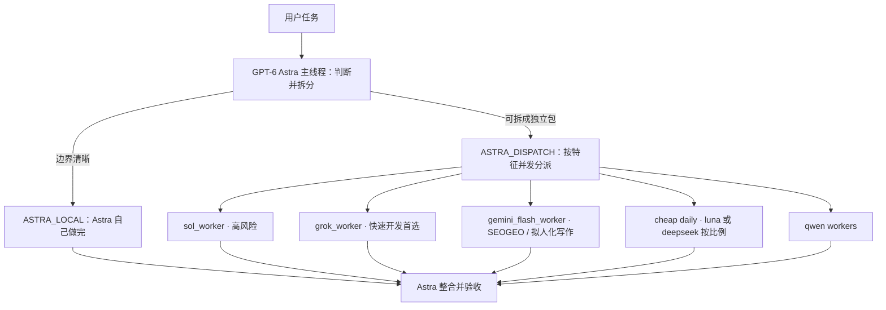

# Astra 多智能体集群工作流

[English](README.en.md)

这是一套 **Codex 配置包**，不是可运行的应用。

核心做法：用 **GPT-6 Astra** 当顾问和调度员，把任务拆成互不重叠的包，再按模型特征并发分给多个 worker。

本项目里的模型调用案例以 [xclis.ai](https://xclis.ai) 的 GPT-稳定组为例；把下面的 `base_url` / `env_key` 改成你方便的 provider 即可。

在自己的 Codex 里用一句话安装：把下面发给 Codex，分析和学习这个项目后做全局安装。

```text
分析和学习这个项目后全局安装在codex里：https://github.com/Easy800/astra-multi-agent-cluster-workflow
```

## 项目特点

1. **Astra 只做顾问和验收。** 高风险判断留在主线程；Worker 只执行被划定的包，不得自称最终验收。
2. **按特征分派，而不是一个模型包办。** 快速开发优先 Grok 4.6；Gemini 3.8 做多模态、SEOGEO 和拟人化中文写作；日常便宜包按比例在 Luna 与 DeepSeek 之间抽。
3. **可并发，但文件必须互斥。** 每个可写文件同一时间只有一个负责人。
4. **磁盘上的 TOML 不能证明运行时真加载了该模型。** 只有 Agent 活动或工具结果写出模型 id，才能报告实际用了谁。

子 Agent 仍消耗 Token，并受账户额度、模型权限和并发上限约束。

## 架构



| 路由 | 何时用 |
| --- | --- |
| `ASTRA_LOCAL` | 需求明确、风险低或中等，单线程更便宜 |
| `ASTRA_DISPATCH` | 至少两个独立、文件互斥、可单独验证的包 |

高风险判断留在 Astra 主线程。落地执行交给对应 worker（高风险专业包用 `sol_worker`）。

## 模型分工

同一套 provider 即可调用下面全部模型。

| 角色 | Agent | 模型 ID |
| --- | --- | --- |
| 顾问 / 调度 | 主线程 | `gpt-6-astra` |
| 高风险专业执行 | `sol_worker` | `gpt-5.6-sol` |
| 快速开发（首选） | `grok_worker` | `grok-4.6` |
| 多模态 / SEOGEO / 拟人化中文写作 | `gemini_flash_worker` | `gemini-3.8-flash` |
| 便宜日常执行 | `luna_worker` 与 `deepseek_flash_worker` 按比例 | `gpt-5.6-luna` / `deepseek-v4-flash` |
| 中文 / 办公长文 | `qwen_flash_worker` | `Qwen3.8-Flash-Next` |
| 低拒答 / 特殊指令 | `qwen_uncensored_worker` | `qwen3.8-27b` |

Grok 4.6 与 Gemini 3.8 Flash 都具备多模态和快速开发能力；**快速开发优先 Grok 4.6**。Gemini 另承担 SEOGEO、中文文章和拟人化写作。每个子任务的推理级别由 Astra 按任务选择，并限制在该模型支持的取值内（见 `AGENTS.md`）。

便宜日常包由 Astra 读 `.codex/agents/cheap-daily.toml` 再抽。默认 `luna = 0`、`deepseek = 10`（DeepSeek-V4-Flash 全跑），因为不少中转站已屏蔽 `gpt-5.6-luna`。改成 `4`/`6` 即每 10 次里 Luna 4 次、DeepSeek 6 次；`10:0` 只用 Luna。

完整能力表：[docs/models.md](docs/models.md)

## 接线示例

用户级 `~/.codex/config.toml`（项目 `.codex/config.toml` 不能写 `model_providers`）。Codex 只认 `wire_api = "responses"`。

```toml
model = "gpt-6-astra"
model_reasoning_effort = "xhigh"
model_provider = "xclis_ai"

[model_providers.xclis_ai]
name = "xclis_ai"
base_url = "https://jp.xclis.ai/v1"
env_key = "API_KEY"
wire_api = "responses"
requires_openai_auth = false
supports_websockets = false
```

```bash
export API_KEY="sk-..."
API_KEY="$API_KEY" codex
```

```bash
curl "$CODEX_BASE_URL/responses" \
  -H "Authorization: Bearer $API_KEY" \
  -H "Content-Type: application/json" \
  -d '{"model":"gpt-6-astra","input":"把任务拆成互不重叠的包，并指定 worker。"}'
```

把 `model` 换成上表里的任意 id。更完整的替换说明见 [docs/providers.md](docs/providers.md)。

## 安装

在自己的 Codex 里用一句话安装：

```text
分析和学习这个项目后全局安装在codex里：https://github.com/Easy800/astra-multi-agent-cluster-workflow
```

也可以把这些文件合并进目标项目，然后 **新开一个 Codex 任务**：

```text
.codex/config.toml
.codex/agents/*.toml
AGENTS.md
```

自定义 Agent 必须有 `name`、`description`、`developer_instructions`，不能只写 `model`。个人全局安装时，把 Agent 文件复制到 `~/.codex/agents/`。

## 显式口令

```text
优先由 GPT-6 Astra 单线程完成；只有存在独立任务包时才 ASTRA_DISPATCH。
```

```text
按模型特征拆给 specialist worker 并行处理；每个可写文件只能有一个负责人。
```

## 文档

| 文档 | 内容 |
| --- | --- |
| [docs/models.md](docs/models.md) | 各模型官方能力与分派信号 |
| [docs/providers.md](docs/providers.md) | provider 参数，可自行替换 |
| [docs/routing-guide.md](docs/routing-guide.md) | 路由例子 |
| [docs/task-packet.md](docs/task-packet.md) | Worker 任务包格式 |
| [docs/verification.md](docs/verification.md) | 静态检查与真实性门禁 |

## 许可协议

[MIT](LICENSE)
