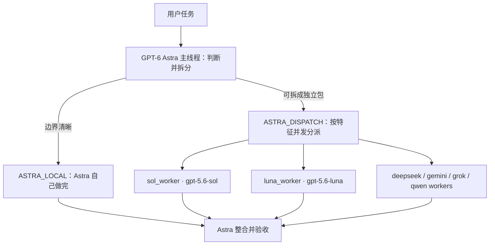

# Astra-dispatch Codex 工作流

[English](README.en.md)

这是一套 **Codex 配置包**，不是可运行的应用。

核心做法：用 **GPT-6 Astra** 当顾问和调度员，把任务拆成互不重叠的包，再按模型特征并发分给多个 worker。GPT 系模型的调用案例一律走 **[Xclis.ai](https://xclis.ai) 官方 GPT-稳定（Stable）组**。

## 项目特点

1. **Astra 只做顾问和验收。** 高风险判断留在主线程；Worker 只执行被划定的包，不得自称最终验收。
2. **按特征分派，而不是一个模型包办。** 编码、长程重构、实时检索、中文办公、低拒答，各走对应 worker。
3. **GPT 调用走 Xclis GPT-稳定组。** 这是 Xclis 给 Codex / Codex App 用的 PRO 稳定通道，不是特惠组。分组绑在 API Key 上，请求里仍用官方模型 ID。
4. **可并发，但文件必须互斥。** 每个可写文件同一时间只有一个负责人。
5. **磁盘上的 TOML 不能证明运行时真加载了该模型。** 只有 Agent 活动或工具结果写出模型 id，才能报告实际用了谁。

子 Agent 仍消耗 Token，并受账户额度、分组权限和并发上限约束。

## 架构



| 路由 | 何时用 |
| --- | --- |
| `ASTRA_LOCAL` | 需求明确、风险低或中等，单线程更便宜 |
| `ASTRA_DISPATCH` | 至少两个独立、文件互斥、可单独验证的包 |

高风险判断留在 Astra 主线程。落地执行交给对应 worker（高风险专业包用 `sol_worker`）。

## 模型分工

| 角色 | Agent | 模型 ID | 调用通道 |
| --- | --- | --- | --- |
| 顾问 / 调度 | 主线程 | `gpt-6-astra` | Xclis **GPT-稳定** |
| 高风险专业执行 | `sol_worker` | `gpt-5.6-sol` | Xclis **GPT-稳定** |
| 便宜日常执行 | `luna_worker` | `gpt-5.6-luna` | Xclis **GPT-稳定** |
| 高速便宜编码 | `deepseek_flash_worker` | `deepseek-v4-flash` | 见 [providers](docs/providers.md) |
| 长程 / 多模态 | `gemini_flash_worker` | `gemini-3.8-flash` | 见 [providers](docs/providers.md) |
| 实时检索 | `grok_worker` | `grok-4.6` | 见 [providers](docs/providers.md) |
| 中文 / 办公长文 | `qwen_flash_worker` | `qwen3.8-flash` | 见 [providers](docs/providers.md) |
| 低拒答 / 特殊指令 | `qwen_uncensored_worker` | `qwen3.8-27b` | 本地 Huihui Q4_K 或兼容网关 |

完整能力表：[docs/models.md](docs/models.md)

## 模型调用案例：Xclis GPT-稳定组

本仓库所有 GPT 示例都按 [Xclis 官方文档](https://xclis.ai/docs/codex) 和 [定价页](https://xclis.ai/pricing) 的 **GPT-稳定（Stable）** 组来写。

官方说明：GPT-稳定是 PRO 渠道，给 Codex 和 Codex App 用，持续稳定。价格约为官方价 × 0.036。不要用 GPT-特惠组跑本工作流——特惠组面向第三方/自订阅，供货不稳定。

分组在看板创建 Key 时选定，**不要**把分组名写进 `model` 字段。

### 1. 准备 Key

1. 打开 [xclis.ai](https://xclis.ai) 注册并进入看板。
2. 创建 API Key，分组选 **GPT-稳定（Stable）**。
3. 把 Key 放到环境变量，不要写进仓库：

```bash
export XCLIS_API_KEY="sk-..."   # 换成你的看板 Key
```

推荐网关（官方 Codex 文档）：`https://jp.xclis.ai/v1`  
全球入口：`https://us.xclis.ai/v1`

### 2. Codex（本工作流的主用法）

用户级 `~/.codex/config.toml`（项目 `.codex/config.toml` 不能写 `model_providers`）：

```toml
model = "gpt-6-astra"
model_reasoning_effort = "high"
model_provider = "xclis"

[model_providers.xclis]
name = "Xclis GPT-稳定"
base_url = "https://jp.xclis.ai/v1"
env_key = "XCLIS_API_KEY"
wire_api = "responses"
requires_openai_auth = false
supports_websockets = false
```

```bash
XCLIS_API_KEY="sk-..." codex
```

Codex 只认 `wire_api = "responses"`。官方接入说明：[xclis.ai/docs/codex](https://xclis.ai/docs/codex)

### 3. curl：Responses（与 Codex 同一协议）

```bash
curl https://jp.xclis.ai/v1/responses \
  -H "Authorization: Bearer $XCLIS_API_KEY" \
  -H "Content-Type: application/json" \
  -d '{
    "model": "gpt-6-astra",
    "input": "把下面任务拆成互不重叠的包，并指出该给 sol_worker 还是 luna_worker。"
  }'
```

换模型只改 `model`：

```text
gpt-6-astra      # 顾问 / 调度
gpt-5.6-sol      # 高风险专业包
gpt-5.6-luna     # 日常执行兜底
```

### 4. curl：Chat Completions（OpenAI 兼容）

```bash
curl https://jp.xclis.ai/v1/chat/completions \
  -H "Authorization: Bearer $XCLIS_API_KEY" \
  -H "Content-Type: application/json" \
  -d '{
    "model": "gpt-5.6-sol",
    "messages": [
      {"role": "user", "content": "只回答：这个缓存策略会不会读到过期的授权数据？给出结论和验收条件。"}
    ]
  }'
```

### 5. Python

```python
import os
from openai import OpenAI

client = OpenAI(
    api_key=os.environ["XCLIS_API_KEY"],
    base_url="https://jp.xclis.ai/v1",
)

# 顾问拆分
plan = client.responses.create(
    model="gpt-6-astra",
    input="拆分任务：前端、序列化、测试分别在不同目录，给出三个互斥文件包。",
)
print(plan.output_text)

# Sol 执行高风险包
ruling = client.chat.completions.create(
    model="gpt-5.6-sol",
    messages=[{"role": "user", "content": "根据已收集证据，给出一致性策略和验收条件。"}],
)
print(ruling.choices[0].message.content)
```

更完整的接线、非 GPT worker、本地 Huihui Q4_K：见 [docs/providers.md](docs/providers.md)。

## 安装

把这些文件合并进目标项目，然后 **新开一个 Codex 任务**：

```text
.codex/config.toml
.codex/agents/*.toml
AGENTS.md
```

自定义 Agent 必须有 `name`、`description`、`developer_instructions`，不能只写 `model`。个人全局安装时，把 Agent 文件复制到 `~/.codex/agents/`。

## 显式口令

```text
优先由 GPT-6 Astra 单线程完成；只有存在独立任务包时才 ASTRA_DISPATCH。
```

```text
按模型特征拆给 specialist worker 并行处理；每个可写文件只能有一个负责人。GPT 调用走 Xclis GPT-稳定组。
```

## 文档

| 文档 | 内容 |
| --- | --- |
| [docs/models.md](docs/models.md) | 各模型官方能力与分派信号 |
| [docs/providers.md](docs/providers.md) | Xclis GPT-稳定接线 + 其他 provider |
| [docs/routing-guide.md](docs/routing-guide.md) | 路由例子 |
| [docs/task-packet.md](docs/task-packet.md) | Worker 任务包格式 |
| [docs/verification.md](docs/verification.md) | 静态检查与真实性门禁 |
| [Xclis Codex 接入](https://xclis.ai/docs/codex) | 官方 Codex 配置 |
| [Xclis 定价](https://xclis.ai/pricing) | GPT-稳定 / 特惠 / 企业 分组 |

## 许可协议

[MIT](LICENSE)
